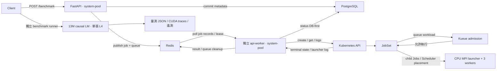

# HPC AI Performance Engineering Platform

以 FastAPI、Redis、PostgreSQL、Kueue 與 JobSet 建立 HPC 工作提交、自動執行及結果回收平台，並在單張 NVIDIA L4 上進行小型語言模型訓練、調校與 CUDA profiling。

更新：2026-09-22。本文是主要展示入口，依序呈現架構、真實驗收、效能分析與操作方式；細節由各段連到原始 JSON、trace 和 runbook。主環境為 GKE `hpc-gpu-sg`，namespace `hpc-platform-dev`；GPU quota 為一張。

[架構](#architecture) · [自動工作驗收](#main-demo) · [效能比較](#performance) · [展示順序](#interview-walkthrough) · [執行方式](#demo-quick-start) · [學習紀錄](#learning-history)

## 已驗證成果

| 能力 | 實際交付與結果 | 原始證據 |
|---|---|---|
| 部署與重建 | 主平台重新部署；全新 CPU-only GKE 完成 controllers／平台 bootstrap、health／RBAC／PVC 驗收與銷毀 | [部署](docs/evidence/platform-deployment-20260921.json)、[重建](docs/evidence/cpu-bootstrap-acceptance-20260921.json) |
| 自動工作生命週期 | 提交 MPI 後自動 dispatch／collect；兩筆工作 completed，回收 ranks 0／1／2，PostgreSQL 狀態一致 | [自動驗收](docs/evidence/automatic-worker-20260922.json) |
| 重啟與失敗處理 | queued／submitted 兩階段 worker 重啟接續；測試工作只建立一個 JobSet；模擬 dispatch 失敗三次後 failed／dead-letter | [同次驗收與 queue 核對](docs/evidence/automatic-worker-20260922.json) |
| 網路與資料保留 | 隔離 Calico GKE allow／deny／recovery；主環境 Redis Pod 替換後測試 key 保留 | [網路](docs/evidence/network-policy-validation-20260921.json)、[Redis](docs/evidence/redis-persistence-migration-20260921.json) |
| AI 效能分析 | 13M causal LM、batch 8／16 各三次交錯量測；保存兩份 CUDA traces 與 GPU 遙測 | [量測 JSON](benchmark/results/causal-lm-20260922/result.json)、[環境及 hashes](benchmark/results/causal-lm-20260922/evidence.json) |

平台主線是 CPU MPI rank smoke test；訓練 benchmark 是同一環境的獨立實驗，尚未接入 MPI API。以下結果均有日期與環境，不能當作即時服務可用性保證。

## Architecture



API 先 commit PostgreSQL，再以 Redis transaction 發布工作。獨立 worker 掃描持久化 job records，依狀態提交或回收結果，每輪結束後等待五秒。Kueue 負責准入，JobSet 管理 launcher／workers，Kubernetes Scheduler 決定 Pod placement。

固定 JobSet 名稱與 owner label 讓提交重試可接回原工作；per-job Redis lease 協調處理，終態先寫 DB 再發布 Redis。這些機制已驗證重啟接續，但兩個資料庫仍沒有跨系統原子交易。

`system-pool` 承載 API／worker／Redis／PostgreSQL；`gpu-pool` 是一張 L4，CPU MPI Pods 可共置其上。三個 MPI workers 不代表三台節點，time-sharing shares 也不代表多張 GPU。完整設計見 [架構文件](docs/architecture/platform-architecture.md)。

## Main Demo

`POST /benchmark` → accepted → 背景 worker 提交 JobSet → submitted → Kueue admission → MPI ranks → 自動收集 → completed／failed → API 與 DB 狀態回寫。

2026-09-22 實機驗收全程不以手動 worker endpoint 推進工作：

| 情境 | 觀察與結果 |
|---|---|
| 正常提交 | `f2d8df72-aef3-48bf-9d6b-6863523daa65` 自動 completed，ranks 為 0／1／2 |
| worker 重啟 | `a697300a-b267-4554-bdd5-2c82bb9c9eda` 在 worker 停止時 accepted；恢復後提交，再次停止期間 JobSet 完成，恢復後自動收回結果；僅一個對應 JobSet |
| 模擬提交失敗 | `0852fb7b-8efd-4600-b8ac-d4205554f6f3` 三次後 failed，ID 進入 dead-letter queue |
| 回寫與隔離 | PostgreSQL 終態與 API 一致；本次工作離開待處理 queue；三個舊手動端點皆回傳 409 |

[原始驗收 JSON](docs/evidence/automatic-worker-20260922.json) 保存 logs、狀態與 queue 核對。[自動 worker runbook](docs/runbooks/automatic-worker.md) 提供重跑與排查步驟。

MPI 此處驗證 distributed launch 與結果回收，未量測 MPI 吞吐；失敗案例是模擬 dispatch failure。舊版手動流程及成功／失敗輸出保留於 [歷史 MPI demo](docs/demo/end-to-end-mpi-jobset-demo.md) 與 [9/21 恢復紀錄](docs/demo/platform-recovery-20260921.md)。

## Core Capabilities

| 領域 | 已有能力與範圍 |
|---|---|
| Platform / API | FastAPI submission／query、Redis queue／retry／dead-letter、MPI dispatch、JobSet terminal state／rank collection、PostgreSQL status sync |
| Distributed Compute | MPI JobSet 主線；獨立 Ray／KubeRay tasks 與 Slurm CPU multi-node MPI experiments |
| GPU / AI Performance | L4 13M causal LM repeated benchmark／batch tuning／CUDA traces、vLLM analysis、CPU DDP profiling、單 GPU NCCL evidence |
| Scheduling | Kueue queue／quota／ResourceFlavor、priority／preemption、單 GPU node TAS placement |
| Observability | API metrics、Prometheus／Grafana／DCGM manifests 與歷史驗證 |
| Infrastructure | GKE、Helm／Kustomize；gpu-sg Terraform import 零 drift，隔離 cluster apply／destroy 已驗證；Argo CD 尚待對齊 |
| Security | Namespace ServiceAccount／RBAC、Pod hardening experiments、隔離 Calico NetworkPolicy allow／deny／recovery |
| Troubleshooting | Admission、placement、runtime resource mismatch、worker failure、Slurm node failure、NCCL fallback |

## Supporting Demos

以下是平行案例，不是 MPI 執行後自動串接的 pipeline；Ray／Slurm 尚未接入主 API。

- [Ray Worker Recovery](docs/demo/ray-worker-recovery-demo.md)：resource mismatch、NODE_DIED retry 與 KubeRay reconciliation。
- [Slurm Failure Troubleshooting](docs/demo/slurm-failure-troubleshooting-demo.md)：成功 CPU multi-node MPI baseline 與 PENDING／node failure 根因定位。
- [NCCL Transport Fallback](docs/demo/nccl-transport-fallback-demo.md)：IB 不可用後選用 Socket，單 rank 初始化 evidence。
- [JobSet Recovery](docs/demo/jobset-recovery-demo.md)：歷史 mpi-real exit 42、整組 Recreate、JobsReady 與 Kueue admission blockage。

## Performance

### 2026-09-22：單 L4 causal LM 與 CUDA profiling

13,003,776 parameters，4 layers、hidden 512、sequence 256；固定 README 文字快照、UTF-8 byte tokenizer、causal mask 與 next-byte targets。BF16／AdamW，每次重建相同 seed；初始 loss step 後暖機 20 步，再量 40 步，依 8、16、16、8、8、16 交錯執行。

| Batch | Mean byte tokens/s | Mean step | Throughput CV | Peak allocated memory（各測次最大值） |
|---:|---:|---:|---:|---:|
| 8 | 110,785 | 18.50 ms | 3.21% | 375.02 MiB |
| 16 | 200,841 | 20.39 ms | 0.42% | 532.39 MiB |

Batch 加倍後吞吐 **+81.29%**，代價是每步延遲 **+10.25%**、顯存峰值 **+41.96%**。每步處理量加倍，不能把吞吐提升說成每步變快。

效能計時完成後另做每組五步 CUDA profiling：

| Raw trace 的 kernel duration sum | Batch 8 | Batch 16 |
|---|---:|---:|
| multi-tensor 名稱群組（AdamW 相關） | 21.71 ms | 21.72 ms |
| GEMM 名稱群組 | 12.27 ms | 23.84 ms |

optimizer 相關成本近乎持平、GEMM 工作量增加，支持「較大 batch 攤薄每步固定成本」的推論。kernel duration sum 不等於 wall time，這份 trace 也不足以單獨斷言 memory-bound 或 compute-bound。

證據：[完整分析](docs/performance/causal-lm-l4-20260922.md)、[逐步數據及遙測](benchmark/results/causal-lm-20260922/result.json)、[重算摘要](benchmark/results/causal-lm-20260922/summary.json)、[batch 8 trace](benchmark/results/causal-lm-20260922/batch8.trace.json.gz)、[batch 16 trace](benchmark/results/causal-lm-20260922/batch16.trace.json.gz)。

範圍：小型隨機初始化 causal LM、固定小語料、單 L4 time-sharing。byte tokens/s 不能直接和 BPE token 數比較；loss 下降不代表已證明泛化品質。未包含 pretrained LLM fine-tuning、多 GPU scaling 或 RDMA。

### 歷史效能案例（各自保留環境與方法）

固定 128 requests 的 vLLM 結果中，concurrency 16／32／64 的 throughput 為 **16.748／24.988／32.379 req/s**；mean TTFT 為 **135.601／188.663／448.579 ms**。32 → 64 的 throughput 增加 29.6%，TTFT 增加 137.8%，呈現此 workload 的 latency tradeoff。

2026-09-21 在 L4 time-sharing share 重跑 BF16 synthetic Transformer training：batch 8→16 的 mean token throughput 為 **101,096→176,335 tokens/s（+74.4%）**，mean step latency **+14.0%**，peak allocated memory **+50.8%**。每組包含 10 warmup 與 3×20 measured steps；詳見 [比較報告](docs/performance/transformer-training-l4-20260921.md)。

另保存 stress-ng CPU saturation、fio ephemeral-storage baseline、同 node iperf3、CPU／Gloo DDP profiling、單 GPU NCCL fallback，以及歷史 P100 DCGM dashboard evidence。它們來自不同環境，未由主 E2E 自動回收。

詳見 [Performance Report](docs/performance/performance-report.md)，包含數據來源、測試方法與限制。

## Infrastructure

主 E2E 使用 GKE `hpc-gpu-sg`、namespace `hpc-platform-dev`：`system-pool` 承載 CPU platform／control workloads，`gpu-pool` 提供一張 NVIDIA L4 給 distributed／GPU workload。Node Pool 不等於單一 node；此環境的 GPU quota 固定為一張，因此 GPU 驗收直接在既有 cluster 進行，不建立第二個 GPU rehearsal cluster。完整 platform overlay 已部署至既有叢集，API／Redis／PostgreSQL 的 system-pool placement、rollout 與資料連線已驗收，見 [部署證據](docs/evidence/platform-deployment-20260921.json)。

[Helm](helm/) 與 [platform Kustomize overlay](kustomize/overlays/gpu-sg-platform/) 保存服務與 API RBAC。[gpu-sg Terraform](terraform/environments/gpu-sg/main.tf) 已描述現有 GKE 與兩個 node pools，import 後 plan 為零 drift。[bootstrap tool](scripts/bootstrap_cluster.py) 鎖定 controllers 版本與 checksum，編排 queues、runtime Secrets 及 platform deployment；全新 CPU-only cluster 已完成 apply／acceptance／destroy。全新 GPU cluster 因專案全域 GPU quota 1／1 尚未完成 MPI 驗收。[Argo CD dev](argocd/application-dev.yaml) 仍屬舊環境，GitOps 尚未對齊主環境。

## Security

API 使用 [api-jobset-runner ServiceAccount／namespace RBAC](k8s/security/api-jobset-rbac.yaml)，以 least privilege 限制 JobSet 操作。另有 [Pod hardening 紀錄](docs/week20/day2-pod-image-secret-security.md)；[NetworkPolicy 實測](docs/evidence/network-policy-validation-20260921.json) 在隔離 Calico GKE 完成 baseline、allow、deny timeout 與 policy 移除後恢復。主 cluster enforcement 仍關閉。SSH private keys 不放入 repo。

## Evidence

[Evidence Index / Capability Matrix](docs/evidence/README.md) 索引各次原始結果與限制。2026-09-22 平台及分析測試共 **53 項通過**（含既有測試），GPU 實測與 worker 重啟驗收另有上述 artifacts；[GPU 實驗後 preflight](docs/evidence/platform-after-training-20260922.json) 的十項前置條件皆通過。

## Interview Walkthrough

README 即為主要展示頁，可依面試方向調整順序：

1. **先說系統設計**：沿上方架構圖解釋 API、資料保存、worker、admission 與 execution 的責任。
2. **展示可操作性**：以部署／CPU-only 重建證據說明環境怎麼建立，再展示 Main Demo 的自動完成與重啟接續。
3. **展示故障判斷**：解釋模擬提交失敗、Redis 資料保留與隔離環境的網路 allow／deny；成功與失敗案例分開呈現。
4. **展示效能工程**：依 Performance 的方法、比較表與 trace，說明吞吐收益、latency／memory 代價，以及固定成本的推論。
5. **交代界線**：說明單 GPU、小模型、跨資料庫一致性與尚未整合的獨立實驗。

架構師／平台方向重點為 1～3；AI 效能方向重點為 4，搭配可追溯的執行環境與結果。[詳細講解備忘](docs/demo/interview-demo-20260922.md) 與 [面試問答](docs/interview/project-interview-guide.md) 作補充；履歷見 [HPC 系統架構版](docs/career/resume-hpc-system.md)、[AI 效能版](docs/career/resume-ai-performance.md)。

## Current Boundary

**已完成：** API submission → queue → dispatch → Kueue admission → MPI ranks → terminal condition／rank collection → Redis／PostgreSQL completed。

**尚未完成：** artifact object storage、跨 Redis／PostgreSQL 原子交易、完整 lifecycle state machine 與 Kubernetes watch。背景 polling reconciliation 已實測完成；其他 benchmark 分支仍為 simulated。Redis 資料全失恢復與 exactly-once 未保證。單 GPU 環境不主張 multi-GPU／multi-node scaling。

## Repository Structure

```text
api/          FastAPI、database、自動 worker、MPI dispatcher／collector
benchmark/    Benchmark scripts 與保存結果
runtime/      PyTorch／vLLM runtime adapters
k8s/          Scheduling、security、workload manifests
helm/         Service／runtime／monitoring charts
kustomize/    Deployment overlays
terraform/    Infrastructure modules 與 environments
analysis/     Performance analyzer
docs/        Architecture、demos、evidence、reports、歷史紀錄
```

## Demo Quick Start

1. 先依 [平台 bootstrap runbook](docs/runbooks/platform-bootstrap.md) 備妥 cluster、controllers、queues、Secrets 與 DB，確認 [自動 worker](docs/runbooks/automatic-worker.md) 已啟用。
2. 另開 terminal 保持 API port-forward：

```bash
kubectl --context gke_project-4b82f780-0a12-4087-b94_asia-southeast1-a_hpc-gpu-sg \
  -n hpc-platform-dev port-forward service/api-service 8000:8000
```

3. 提交 MPI 工作，記下回傳的 `job_id`：

```bash
curl -sS -X POST http://127.0.0.1:8000/benchmark \
  -H 'Content-Type: application/json' -d '{"benchmark":"mpi"}'
```

4. Worker 自動處理；使用本次 `job_id` 查詢 `status` 與 `result.jobset_name`：

```bash
curl -sS "http://127.0.0.1:8000/jobs/<job_id>"
```

5. 將下面 placeholder 替換為本次回傳的 JobSet name，查看 admission 後是否 `SUSPENDED=false`：

```bash
MPI_JOBSET='mpi-<job_id>'
kubectl --context gke_project-4b82f780-0a12-4087-b94_asia-southeast1-a_hpc-gpu-sg \
  -n hpc-platform-dev get jobset "$MPI_JOBSET"
```

6. Launcher 啟動後查看該 child Job 的 log，確認 rank 0／1／2：

```bash
kubectl --context gke_project-4b82f780-0a12-4087-b94_asia-southeast1-a_hpc-gpu-sg \
  -n hpc-platform-dev logs "job/${MPI_JOBSET}-launcher-0" -c launcher
```

7. JobSet 結束後 worker 自動回收結果，再以提交時取得的 `job_id` 查詢：

```bash
curl -sS "http://127.0.0.1:8000/jobs/<job_id>"
```

回應應包含 `status: completed`、JobSet terminal condition 與 `ranks: [0, 1, 2]`。

### 重算效能摘要與重跑實驗

以下只讀原始 artifacts、核對 hashes，並重新產出 summary.json；不啟動 GPU：

```bash
PYTHONPATH=. .venv/bin/python -m analysis.causal_lm_report benchmark/results/causal-lm-20260922
```

需要重新測量時依 [單 GPU 操作文件](docs/runbooks/causal-lm-benchmark.md) 執行，使用唯一的實驗名稱與新結果目錄。程式會建立臨時 GPU Pod，取回證據後清理；原始快照與過去結果保留。

## Limitations / Future Improvements

後續改善集中於 result artifact storage、跨資料庫一致性、非空 Redis 備份還原、Alembic schema migration，以及 IaC／GitOps alignment。自動 worker、Redis PVC 與 graceful Pod replacement 已驗證。Multi-node GPU／RDMA performance 需另備硬體與驗證。

<a id="learning-history"></a>

## Week1～Week20 學習總覽

從 Linux 與 Python 基礎出發，逐步學習容器化、平台開發、雲端部署、效能分析，以及 HPC／AI 分散式運算與排障。下表依各週學習文件整理；點選週次可查看完整筆記與實驗紀錄。表中的概念學習與歷史實作不代表目前平台已全面整合，現行架構與成果見上方主展示，完整驗證範圍見 [Evidence Index](docs/evidence/README.md)。

| 週次 | 學習主題 | 學習內容與能力 | 技能／技術 |
|---|---|---|---|
| [Week1](docs/week1/) | Linux 系統基礎 | 理解程序、CPU 排程、上下文切換、記憶體與磁碟 I/O；建立逐層定位效能瓶頸的思路 | Linux、Process／PID、Scheduler、Context Switch、top、ps、free、iostat |
| [Week2](docs/week2/) | Python 與系統資訊收集 | 使用變數、函式與回傳值組織程式，以資料結構表示程序資訊；執行 Linux 指令並取得輸出 | Python、Function、return、List、Dictionary、subprocess、stdout |
| [Week3](docs/week3/) | Docker 容器化 | 安裝 Docker、區分 Image 與 Container；建置監控程式映像、管理容器生命週期，理解 namespace 隔離 | Docker Engine、Dockerfile、Image、Container、Docker Compose、Namespace |
| [Week4](docs/week4/) | 平台 API 與工作佇列 | 設計工作提交與查詢 API、Job ID 與記憶體佇列；整合容器設定、健康檢查、日誌與基本指標 | FastAPI、Uvicorn、REST API、Pydantic、OpenAPI、Producer／Consumer、Docker Compose |
| [Week5](docs/week5/) | 工作狀態與資料持久化 | 將狀態移至 Redis，學習持久化、worker 狀態轉移、逾時恢復與重試上限；以 PostgreSQL 保存 metadata | Redis、RDB／AOF、Processing Queue、Retry、Dead Letter Queue、PostgreSQL、SQLAlchemy ORM |
| [Week6](docs/week6/) | Kubernetes 平台部署 | 理解控制器與服務探索；建立 K3s 環境，部署 API、Redis、PostgreSQL，串接服務與持久化儲存 | Kubernetes、K3s、Pod、Deployment、ReplicaSet、Service、Namespace、StatefulSet、PVC |
| [Week7](docs/week7/) | Kubernetes 服務管理 | 分離設定與敏感資訊、配置資源與健康探針；建立對外路由，透過負載測試觀察 HPA 擴容 | ConfigMap、Secret、Requests／Limits、QoS、Probes、NodePort、Ingress／Traefik、HPA、k6 |
| [Week8](docs/week8/) | GitOps 與多環境部署 | 學習宣告式同步，將服務封裝為 Helm Charts；管理 release／rollback，整合 dev／stage／prod 設定與部署 | GitOps、Argo CD、Helm、Values／Templates、Release、Kustomize Base／Overlay、Reconciliation |
| [Week9](docs/week9/) | Infrastructure as Code | 管理雲端資源生命週期、state 與 module 重構；串接 VM、網路、防火牆及多環境設定，建立 GKE 與 Node Pool | Terraform、HCL、Provider、Plan／Apply、State Migration、Module／Output、GCP VPC、GKE |
| [Week10](docs/week10/) | CI/CD 與自動化測試 | 建立語法、品質與 API 測試流程，以 mock 隔離外部依賴；串接映像建置、推送與 GitOps 部署更新 | GitHub Actions、Ruff、Pytest、TestClient、Fixture／Monkeypatch、Docker Build、Artifact Registry、Argo CD |
| [Week11](docs/week11/) | 平台可觀測性 | 建立監控 Node Pool，理解 pull model 與 target 狀態；收集 API／Node 指標，整合自動探索與儀表板 | Prometheus、Scrape Job／Target、FastAPI Instrumentator、Node Exporter、Grafana、Kubernetes Service Discovery、RBAC |
| [Week12](docs/week12/) | Linux 效能診斷 | 分析 CPU、記憶體、磁碟與歷史負載；建立 CPU baseline，透過 profiling 與 system call 追蹤定位瓶頸 | top、mpstat、pidstat、vmstat、iostat、sar／sysstat、fio、sysbench、perf、strace |
| [Week13](docs/week13/) | Benchmark 與結果整合 | 量測 API、Redis、資料庫、CPU、儲存與網路；比較併發、吞吐與延遲，整合資源觀察、PASS／FAIL 與結果保存 | ApacheBench、redis-benchmark、pgbench、stress-ng、fio、iperf3、kubectl top、Shell、tee／pipefail |
| [Week14](docs/week14/) | GPU 排程與監控 | 理解 GPU 資源宣告與 Pending 原因，建立 GKE GPU Node Pool；執行 CUDA workload，觀察 GPU 使用率、顯存與溫度 | NVIDIA Device Plugin、nvidia.com/gpu、Taints／Tolerations、CUDA、nvidia-smi、DCGM Exporter、Prometheus、Grafana |
| [Week15](docs/week15/) | AI Runtime 與推論效能 | 執行 PyTorch 訓練與 vLLM 推論，建立 runtime adapter；以 concurrency benchmark 與 JSON 結果分析吞吐和延遲取捨 | PyTorch、DataLoader、CUDA、vLLM、Runtime Abstraction、Continuous Batching、KV／Prefix Cache、TTFT／TPOT／ITL |
| [Week16](docs/week16/) | 分散式訓練與通訊效能 | 理解 rank、rendezvous 與梯度同步；實作 CPU／Gloo DDP，分析 1→2 workers scaling，進行單 GPU NCCL 測試 | torchrun、PyTorch DDP、Gloo、RANK／WORLD_SIZE、AllReduce、NCCL、nccl-tests、Speedup／Scaling Efficiency |
| [Week17](docs/week17/) | HPC 分散式運算與排程 | 實作 MPI 通訊與單節點 OSU 測試、Slurm CPU 多節點 MPI、Ray tasks／actors；比較排程層次，理解 RDMA 通訊架構與硬體需求 | Open MPI、OSU Micro-Benchmarks、Slurm、MUNGE、Ray／KubeRay、RayJob；RDMA／RoCE／InfiniBand 概念 |
| [Week18](docs/week18/) | 網路與分散式通訊排障 | 建立頻寬、延遲、丟包與 MTU 基線；從封包追查連線故障，逐層檢查 Kubernetes 網路、NCCL Socket fallback 與 GPU／NIC／NUMA locality | ip／ss、ping、iperf3、tcpdump、iptables、ethtool、DNS／EndpointSlice、NCCL Debug、PCIe／NUMA |
| [Week19](docs/week19/) | GPU 共享與工作准入 | 比較 GPU 共享模式，實驗 time-slicing、quota、priority／preemption；整合 JobSet MPI，驗證單 GPU node 的 TAS placement | Time-Slicing、MPS／MIG 概念、Kueue、ResourceFlavor、ClusterQueue／LocalQueue、PriorityClass、JobSet、TAS |
| [Week20](docs/week20/) | 安全、故障恢復與技術選型 | 實作最小權限與 Pod hardening、NetworkPolicy 設計／schema 驗證及隔離 Calico 封包驗收；分析 JobSet recovery、Ray retry、Slurm node failure，整理跨層排障與架構選型 | RBAC／ServiceAccount、SecurityContext、Image／Secret Security、NetworkPolicy、FailurePolicy、Runbook；OpenStack／HTCondor／LSF／DLRover 概念 |


這些學習紀錄保留各自日期、環境、成功與失敗輸出；新操作以本文連結的 runbook 為準。[一週補強紀錄](docs/career/one-week-sprint.md) 保存本次整合過程。
