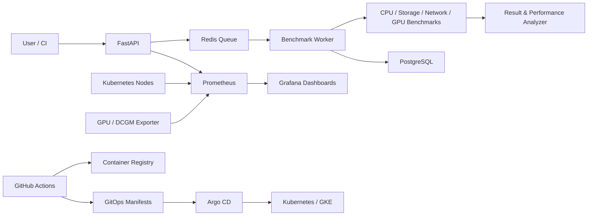

# HPC AI Performance Platform

> 一套整合 Benchmark、Kubernetes、GitOps、Observability 與 GPU/AI Runtime 分析的雲端原生效能工程平台。

[](./.github/workflows)
[](./k8s)
[](./terraform)
[](./monitoring)
[](./api)

## 專案簡介

這是我的 HPC／AI Performance Engineering 實作專案。專案從 Linux 效能分析與 Python 自動化開始，逐步建立 FastAPI、Redis、PostgreSQL 後端，完成 Docker 與 Kubernetes 部署，再整合 Terraform、GKE、GitHub Actions、Argo CD、Prometheus、Grafana，以及 CPU、Storage、Network、GPU、PyTorch 與 vLLM 效能測試。

這個專案的核心目標不是單獨展示某個工具，而是建立一條可重現的工程流程：

> 部署工作負載 → 執行 Benchmark → 收集 Metrics → 分析 Bottleneck → 產生改善建議

## 我解決的問題

- 將零散的效能測試整合成模組化 Benchmark Framework。
- 透過 API、Queue、Worker 與資料庫管理非同步測試工作。
- 使用 Kubernetes 與 GitOps 建立可重現的多環境部署流程。
- 將應用程式、節點與 GPU Metrics 接入 Prometheus／Grafana。
- 以 `perf`、`strace`、sysbench 與負載測試工具建立系統化診斷流程。
- 對 PyTorch Training 與 vLLM Inference 進行瓶頸分析，而不只觀察單一吞吐量數字。

## 系統架構



## 主要成果

### Platform Backend

- FastAPI REST API 與 Job Identity
- Redis 非同步 Queue 與 Worker State Machine
- Retry Strategy、Stuck Job Recovery 與 Dead Letter Queue
- PostgreSQL／SQLAlchemy 持久化資料層
- Health Check、Logging 與 Application Metrics

### Cloud Native & GitOps

- Docker／Docker Compose 容器化
- Kubernetes Deployment、Service、StatefulSet 與 Persistent Volume
- ConfigMap、Secret、Resource Requests／Limits 與 Health Probes
- Traefik Ingress 與 Horizontal Pod Autoscaler
- Helm、Kustomize、Argo CD 多環境 GitOps
- Dev、Stage、Prod 獨立環境與自動同步
- Terraform Modules 與 GKE Infrastructure as Code

### CI/CD & Quality

- GitHub Actions CI Pipeline
- Ruff 程式碼品質檢查
- Pytest 與 Mock API 測試
- Docker Image Build 與 Artifact Registry Push
- 更新 Helm Image Tag、Argo CD Auto Sync 與 Rolling Update

### Observability & Performance

- Prometheus、Node Exporter 與 Kubernetes Service Discovery
- Grafana Application、Node 與 GPU Dashboard
- NVIDIA DCGM Exporter GPU Metrics
- Linux CPU、Memory、Disk 與 System Call 分析
- CPU、Storage、Network、Redis、PostgreSQL 與 API Benchmark
- PyTorch Training、DataLoader 與 vLLM Serving Saturation 分析

## 可驗證成果

- Kubernetes HPA 經壓力測試完成 Scale Out／Scale In。
- GitOps 建立 Dev、Stage、Prod 三套環境並完成自動同步與 Ingress Routing。
- Terraform 建立 GKE Cluster 與 Node Pool，並以 Zonal Cluster 調整開發成本。
- Prometheus 使用 Kubernetes Service Discovery 自動發現 Node Exporter，文件記錄 Targets `2/2 UP`。
- GPU Dashboard 透過實際 CUDA workload 驗證，GPU utilization 約由 `0%` 上升至 `100%`。
- Benchmark Platform v1 已整合 CPU、Storage、Database 與 Network 測試及結果收集。
- Performance Analyzer 可進行 vLLM Serving Saturation 與 PyTorch DataLoader Bottleneck 分析。

詳細操作、指令與實驗紀錄請參閱 [15 週開發文件](./docs)。

## 技術棧

| 領域 | 技術 |
|---|---|
| Backend | Python, FastAPI, SQLAlchemy, Redis, PostgreSQL |
| Container | Docker, Docker Compose |
| Orchestration | Kubernetes, K3s, GKE, Traefik, HPA |
| GitOps | Helm, Kustomize, Argo CD |
| Infrastructure | Terraform, Google Cloud |
| CI/CD | GitHub Actions, Artifact Registry |
| Observability | Prometheus, Grafana, Node Exporter, DCGM Exporter |
| Testing | Pytest, Ruff, k6 |
| Performance | sysbench, perf, strace, Redis Benchmark, PostgreSQL Benchmark |
| AI Runtime | CUDA, PyTorch, vLLM |

## Repository 結構

```text
.
├── .github/workflows/   # CI/CD workflows
├── analysis/            # 效能分析工具
├── api/                 # FastAPI 與平台 API
├── argocd/              # Argo CD Applications
├── benchmark/           # Benchmark framework 與測試模組
├── docker/              # Container definitions
├── docs/                # Week 1–15 開發與實驗紀錄
├── helm/                # Helm charts
├── k8s/                 # Kubernetes manifests
├── kustomize/overlays/  # Dev / Stage / Prod overlays
├── loadtest/            # API 與平台負載測試
├── monitoring/          # Prometheus / Grafana / Exporters
├── runtime/             # PyTorch / vLLM runtime abstraction
├── terraform/           # GCP / GKE infrastructure
├── tests/               # Automated tests
└── compose.yaml          # Local multi-service environment
```

## 快速開始

### 需求

- Docker Engine 或 Docker Desktop
- Docker Compose v2
- Git

### 啟動本機環境

```bash
git clone https://github.com/davidtestdocker/hpc.git
cd hpc
docker compose up -d --build
docker compose ps
```

查看服務 Log：

```bash
docker compose logs -f
```

停止環境：

```bash
docker compose down
```

Kubernetes、GKE、GitOps 與 GPU 環境需要額外的 Cluster／Cloud 設定，請依照 [`docs`](./docs)、[`k8s`](./k8s)、[`terraform`](./terraform) 與 [`argocd`](./argocd) 中的內容操作。

## 開發歷程

| 階段 | 內容 | 狀態 |
|---|---|---|
| Week 1–2 | Linux Performance 與 Python Automation | ✅ 完成 |
| Week 3–5 | Docker、API、Queue、Worker、Database | ✅ 完成 |
| Week 6–8 | Kubernetes、進階部署與 GitOps | ✅ 完成 |
| Week 9–10 | Terraform／GKE 與 CI/CD | ✅ 完成 |
| Week 11–12 | Observability 與 Linux Diagnostics | ✅ 核心完成 |
| Week 13 | Benchmark Platform v1 | ✅ 完成 |
| Week 14 | GPU Scheduling 與 GPU Observability | ✅ 核心完成 |
| Week 15 | PyTorch、vLLM、Benchmark Engine、Analyzer  | ✅ 完成 

## 目前定位與後續方向

目前版本定位為可展示與持續迭代的 Engineering MVP，已完成主要技術鏈路，但不宣稱可直接用於正式生產環境。

後續預計加強：

- API Authentication、Authorization 與 Rate Limiting
- Container Image／Dependency Security Scanning
- Alertmanager、SLO／SLI 與正式告警規則
- Database Backup、Disaster Recovery 與 High Availability
- Benchmark Regression Gate 與歷史趨勢比較
- 一鍵式 End-to-End Deployment／Verification
- 完成 Week 15 最終整合報告

## 我在此專案展現的能力

- 從 Linux Kernel／System Call 到 Kubernetes／Cloud 的跨層問題分析
- 將學習內容轉化為可執行的工程平台，而不只停留在概念筆記
- 建立 CI/CD、GitOps、Observability 與 Infrastructure as Code 流程
- 使用實驗數據提出瓶頸假設、控制變因並驗證改善方向
- 持續留下可重現的技術文件與操作紀錄

## 文件

完整的逐日實作與故障排除紀錄：[`docs/week1`](./docs/week1) ～ [`docs/week15`](./docs/week15)

---

如果你是面試官或工程團隊成員，建議依序查看：

1. [`docs/week13`](./docs/week13)：Benchmark Platform v1
2. [`docs/week10`](./docs/week10)：CI/CD 與 GitOps 自動部署
3. [`docs/week11`](./docs/week11)：Prometheus／Grafana Observability
4. [`docs/week14`](./docs/week14)：GPU Monitoring
5. [`docs/week15`](./docs/week15)：PyTorch／vLLM Performance Analysis


