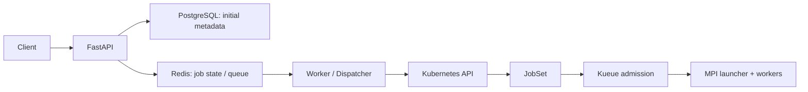

# HPC AI Performance Engineering Platform

## Overview

以 API 驅動 distributed HPC／AI workload submission、scheduling 與 execution，結合 observability、performance analysis 和 failure troubleshooting 的工程作品。

主展示是 FastAPI → Redis queue → Kubernetes JobSet／Kueue → MPI ranks；Ray、Slurm、NCCL 與效能實驗提供平行的 supporting evidence。作品對應 HPC AI Performance、GPU Platform、AI Infrastructure 與 Platform Engineering，已完成工作提交與 rank execution，尚未形成完整 benchmark lifecycle 閉環。

## Architecture



Worker 目前由 `POST /worker/process-next` 手動觸發。Kueue 處理 queue／quota／TAS admission；JobSet 管理 distributed job grouping；admission 後由 Kubernetes Scheduler 完成 Pod placement。PostgreSQL 保存初始 metadata，後續 job state 目前在 Redis。

完整分工與 Node Pool 邊界見 [Final Architecture](docs/architecture/platform-architecture.md)。

## Main Demo

`POST /benchmark` → Redis queue → worker dispatch → 動態 `mpi-<job_id>` JobSet → Kueue admission → 1 launcher + 3 workers → 3 MPI ranks。

已保存成功 JobSet `mpi-52eedc2a-f6b1-4c97-9c11-529223ed6899` 與 rank 0／1／2 輸出。這是 GPU node pool 上的 CPU MPI execution demo，不能等同 multi-node GPU benchmark。

- [End-to-End MPI JobSet Demo](docs/demo/end-to-end-mpi-jobset-demo.md)：前置條件、操作與成功 evidence。
- [Platform Demo Script](docs/demo/platform-demo-script.md)：展示順序。

## Core Capabilities

| 領域 | 已有能力與範圍 |
|---|---|
| Platform / API | FastAPI submission／query、PostgreSQL initial metadata、Redis queue／retry／dead-letter、MPI dispatch |
| Distributed Compute | MPI JobSet 主線；獨立 Ray／KubeRay tasks 與 Slurm CPU multi-node MPI experiments |
| GPU / AI Performance | vLLM concurrency analysis、PyTorch runtime／CPU DDP profiling、單 GPU NCCL transport evidence |
| Scheduling | Kueue queue／quota／ResourceFlavor、priority／preemption、單 GPU node TAS placement |
| Observability | API metrics、Prometheus／Grafana／DCGM manifests 與歷史驗證 |
| Infrastructure | GKE、Helm／Kustomize、Terraform／Argo CD 部署成果；新舊環境尚待對齊 |
| Security | Namespace ServiceAccount／RBAC、Pod hardening experiments、NetworkPolicy design／schema validation |
| Troubleshooting | Admission、placement、runtime resource mismatch、worker failure、Slurm node failure、NCCL fallback |

## Supporting Demos

以下是平行案例，不是 MPI 執行後自動串接的 pipeline；Ray／Slurm 尚未接入主 API。

- [Ray Worker Recovery](docs/demo/ray-worker-recovery-demo.md)：resource mismatch、NODE_DIED retry 與 KubeRay reconciliation。
- [Slurm Failure Troubleshooting](docs/demo/slurm-failure-troubleshooting-demo.md)：成功 CPU multi-node MPI baseline 與 PENDING／node failure 根因定位。
- [NCCL Transport Fallback](docs/demo/nccl-transport-fallback-demo.md)：IB 不可用後選用 Socket，單 rank 初始化 evidence。
- [JobSet Recovery](docs/demo/jobset-recovery-demo.md)：歷史 mpi-real exit 42、整組 Recreate、JobsReady 與 Kueue admission blockage。

## Performance

固定 128 requests 的 vLLM 結果中，concurrency 16／32／64 的 throughput 為 **16.748／24.988／32.379 req/s**；mean TTFT 為 **135.601／188.663／448.579 ms**。32 → 64 的 throughput 增加 29.6%，TTFT 增加 137.8%，呈現此 workload 的 latency tradeoff。

另保存 stress-ng CPU saturation、fio ephemeral-storage baseline、同 node iperf3、CPU／Gloo DDP profiling、單 GPU NCCL fallback，以及歷史 P100 DCGM dashboard evidence。它們來自不同環境，未由主 E2E 自動回收。

詳見 [Performance Report](docs/performance/performance-report.md)，包含數據來源、測試方法與限制。

## Infrastructure

主 E2E 使用 GKE `hpc-gpu-sg`、namespace `hpc-platform-dev`：`system-pool` 承載 CPU platform／control workloads，`gpu-pool` 提供 NVIDIA L4 distributed／GPU workload 資源。Node Pool 不等於單一 node，現有 platform overlay 也未以 nodeSelector 明確鎖定 system-pool。

[Helm](helm/) 與 [platform Kustomize overlay](kustomize/overlays/gpu-sg-platform/) 保存服務與 API RBAC。現有 [Terraform dev](terraform/environments/dev/main.tf) 定義 hpc-dev，[Argo CD dev](argocd/application-dev.yaml) 指向舊 overlays/dev；**hpc-gpu-sg 主 E2E 與舊 IaC／GitOps environment 尚未完全對齊**。

## Security

API 使用 [api-jobset-runner ServiceAccount／namespace RBAC](k8s/security/api-jobset-rbac.yaml)，以 least privilege 限制 JobSet 操作。另有 [Pod hardening 紀錄](docs/week20/day2-pod-image-secret-security.md) 與 [NetworkPolicy 設計](docs/week20/day3-networkpolicy-tenant-isolation.md)；後者僅驗證 schema，未驗證 packet deny enforcement。SSH private keys 不放入 repo。

## Evidence

[Evidence Index / Capability Matrix](docs/evidence/README.md) 將 15 項能力對應到真實 scripts、manifests、JSON／log 與 historical records，逐項標示 verified scope 和 limitation。歷史結果不代表目前 cluster 即時狀態。

## Current Boundary

**已完成：** API submission → queue → dispatch → Kueue admission → MPI ranks。

**尚未完成：** automatic worker daemon、JobSet completion watcher、Kubernetes final status → API／DB sync、result collector、full lifecycle state machine。MPI job API 目前停在 `submitted`；其他 benchmark 分支仍可能 simulated。既有 rank demo 不等於完整 production-ready benchmark system。

## Repository Structure

```text
api/          FastAPI、database、MPI renderer／dispatcher
benchmark/    Benchmark scripts 與保存結果
runtime/      PyTorch／vLLM runtime adapters
k8s/          Scheduling、security、workload manifests
helm/         Service／runtime／monitoring charts
kustomize/    Deployment overlays
terraform/    Infrastructure modules 與 environments
analysis/     Performance analyzer
docs/        Architecture、demos、evidence、reports、歷史紀錄
```

## Demo Quick Start

1. 先完成 [Demo prerequisite](docs/demo/end-to-end-mpi-jobset-demo.md)：確認 cluster context、namespace、平台服務、JobSet／Kueue／queues、SSH Secret 與 DB init。此處假設平台已部署且可用，完整設定見該文件。
2. 另開 terminal 保持 API port-forward：

```bash
kubectl port-forward -n hpc-platform-dev service/api-service 8000:8000
```

3. 提交 MPI 工作，記下回傳的 `job_id`：

```bash
curl -sS -X POST http://127.0.0.1:8000/benchmark \
  -H 'Content-Type: application/json' -d '{"benchmark":"mpi"}'
```

4. 觸發 worker，確認回傳 `job_id` 與 `result.jobset_name` 對應本次工作。此 endpoint 取 queue 中下一筆，若有其他 pending jobs，可能先處理它們。

```bash
curl -sS -X POST http://127.0.0.1:8000/worker/process-next
```

5. 將下面 placeholder 替換為本次回傳的 JobSet name，查看 admission 後是否 `SUSPENDED=false`：

```bash
MPI_JOBSET='mpi-<job_id>'
kubectl get jobset "$MPI_JOBSET" -n hpc-platform-dev
```

6. Launcher 啟動後查看該 child Job 的 log，確認 rank 0／1／2：

```bash
kubectl logs -n hpc-platform-dev "job/${MPI_JOBSET}-launcher-0" -c launcher
```

## Limitations / Future Improvements

後續改善集中於 worker daemon、lifecycle watcher／final status sync、result collector、Redis persistence、Alembic schema migration，以及 IaC／GitOps alignment。Multi-node GPU／RDMA performance 需另備硬體與驗證，現有 evidence 不涵蓋這些結論。
