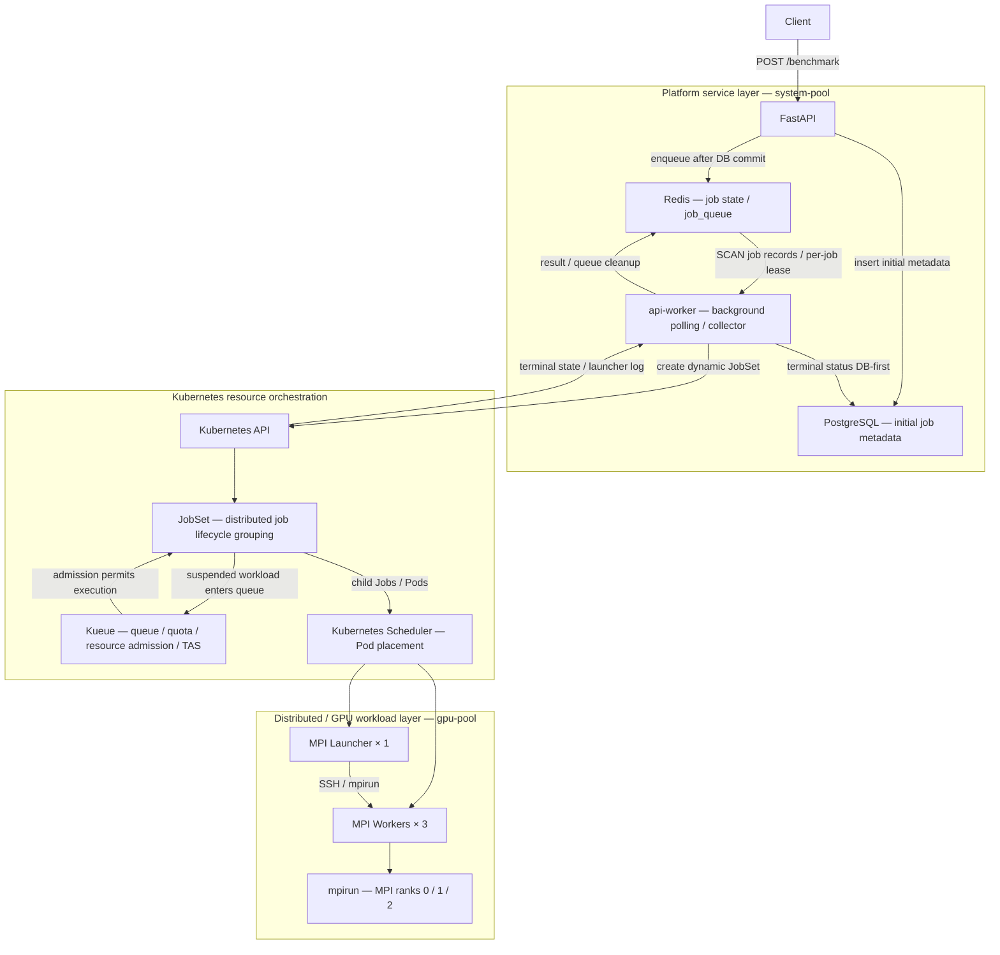

# HPC AI Performance Engineering Platform — Final Architecture

> 更新至 2026-09-22：獨立自動 worker、重啟接續與結果回收已驗收。先前 Redis PVC、controllers、平台部署與 CPU-only fresh bootstrap 證據保留。進度見 [一週計畫](../career/one-week-sprint.md)，操作見 [自動 worker](../runbooks/automatic-worker.md)。

## Platform Positioning

若尚未熟悉 Linux、API、Kubernetes 等名詞，先依[基礎導讀](../learning-guide.md)從 Week1 逐週學，再回到本頁串起元件；本頁不是入門教材。

HPC AI Performance Engineering Platform 是以工作提交、資源 admission、distributed execution 與跨層排障為核心的工程作品。主線展示 API 如何將 MPI 工作送入 Kubernetes／Kueue／JobSet；平行的 performance experiments 與 failure demos 展示資源診斷、效能分析及 recovery 能力。

作品對應 HPC AI Performance Engineer、GPU Platform Engineer、AI Infrastructure Engineer 與 Platform Engineer 的工作範疇。目前可展示範圍以 repo 實作與已保存 evidence 為準，尚未形成完整 benchmark closed-loop system。

閱讀入口：[現行自動 worker](../runbooks/automatic-worker.md)、[9/22 展示講稿](../demo/interview-demo-20260922.md)、[Evidence Index](../evidence/README.md)。舊手動 MPI demo 保留為歷史紀錄。本文件描述保存的成功環境與程式邊界，不代表即時 cluster 健康檢查。

## Main Platform Flow

2026-09-22：API 先 commit PostgreSQL metadata，再用 Redis transaction 發布 job record 與 queue entry；背景 worker 共用兩個資料來源。沒有跨系統 transaction，DB-only submission 的失敗邊界見 [runbook](../runbooks/automatic-worker.md)。

Worker 是獨立 `api-worker` Deployment，每五秒 SCAN job records，取得可續期 per-job lease 後提交或收集。JobSet 固定名稱加 owner label 支援 create 重試；主 overlay 啟用時手動 worker endpoints 回傳 409。僅 MPI 呼叫真實 Kubernetes dispatcher，其他 benchmark 仍是 simulated。重啟與終態驗收見 [證據](../evidence/automatic-worker-20260922.json)。

Kueue 負責 queue、quota、ResourceFlavor 與 topology-aware resource scheduling／admission；Kubernetes Scheduler 負責 Pod 到 node 的 placement。JobSet 將 launcher／worker child Jobs 組成 distributed job lifecycle 單位，並依 failure policy 執行整組 recovery。圖中 JobSet 與 Kueue 的往返代表 controller 協作，不是同步函式呼叫。

| 實作責任 | Repo 入口 |
|---|---|
| Submission、queue、worker handler、Redis job status | [api/main.py](../../api/main.py) |
| PostgreSQL Job model／初始化 | [models.py](../../api/database/models.py)、[init_db.py](../../api/database/init_db.py) |
| 動態 `mpi-<job_id>` 與 worker DNS | [renderer.py](../../api/workloads/renderer.py) |
| In-cluster credentials／CustomObjectsApi | [dispatcher.py](../../api/workloads/dispatcher.py) |
| Launcher 1、workers 3、SSH、failure policy | [MPI template](../../api/workloads/templates/jobset-mpi.yaml) |
| Kueue resource configuration | [ClusterQueue](../../k8s/gpu-scheduling/clusterqueue.yaml)、[LocalQueue](../../k8s/gpu-scheduling/localqueue.yaml)、[ResourceFlavor](../../k8s/gpu-scheduling/resourceflavor.yaml)、[Topology](../../k8s/gpu-scheduling/topology.yaml) |

## GKE Architecture

主 E2E cluster 為 `hpc-gpu-sg`，platform namespace 為 `hpc-platform-dev`。

| Node Pool | 資源與用途 | Scheduling 邊界 |
|---|---|---|
| `system-pool` | CPU；FastAPI、Redis、PostgreSQL 等 platform/control workloads 與 kube-system workloads | 服務層部署分工；這不是 GKE managed Kubernetes control plane 本身 |
| `gpu-pool` | NVIDIA L4；MPI／distributed／GPU workloads | GPU taint：`nvidia.com/gpu=present:NoSchedule`；MPI launcher／worker 均有對應 toleration |

Node Pool 是 node 的管理群組，不等於單一 node；pool 名稱不能用來推論 node 數量。歷史 TAS／recovery 實驗只有一個實體 GPU node，主 E2E 的三個 worker Pod 也不能作為三台 node 的證據。

目前 [platform overlay](../../kustomize/overlays/gpu-sg-platform/kustomization.yaml) 包含 API、Redis、PostgreSQL 與共用 [API JobSet RBAC](../../k8s/security/api-jobset-rbac.yaml)。API 使用 `api-jobset-runner`，在 namespace 內具備 `get/list/watch/create jobsets`。主環境 image tag 保存在獨立的 [api-values.yaml](../../kustomize/overlays/gpu-sg-platform/api-values.yaml)，舊 dev GitOps 仍使用 values-dev.yaml。

新版 overlay 已以 nodeSelector 指定 API／Redis／PostgreSQL 使用 system-pool，完整 overlay 已在既有主叢集部署並驗證三個服務的 rollout 與實際 Pod placement。MPI placement 還依賴 Kueue ResourceFlavor／TAS，toleration 本身只允許 Pod 接受 taint，並不強制選擇 GPU node。

Overlay 本身不建立 GKE cluster、JobSet／Kueue controllers、queue resources 或 `mpi-ssh-key`；這些步驟由釘版的 `scripts/bootstrap_cluster.py` 編排。DB 初始化仍使用 `python -m api.database.init_db`。完整前置條件與安全 SSH Secret 建立方式見 [Demo prerequisite](../demo/end-to-end-mpi-jobset-demo.md)。Private key 不保存在 repo。

## Supporting Engineering Paths

以下是平行 supporting demos／experiments，不是 MPI 執行後自動串接的 pipeline，也不表示全部部署於 `hpc-gpu-sg`。各自的環境、輸出與限制由 [Evidence Index](../evidence/README.md) 指向原始紀錄。

| Supporting path | 展示責任與主線關係 |
|---|---|
| Ray／KubeRay | Kubernetes Pod placement 與 Ray task scheduling 的差異；resource mismatch、task retry、worker reconciliation；未接入 API dispatcher |
| Slurm | 獨立 CPU HPC 環境的 multi-node MPI、partition／node／job 排障；不在 Kubernetes MPI 主線後面 |
| NCCL | 單 GPU transport discovery、IB 不可用後選用 Socket；不是主 MPI demo 自動執行的 benchmark |
| PyTorch／DDP | GPU runtime、training 與 CPU／Gloo DDP profiling 實驗；runtime adapters 未接入目前 MPI dispatch |
| 13M causal LM／CUDA profiler | 9/22 單 L4 training、batch 比較、raw CUDA traces；獨立 benchmark runner，未接 MPI API。見 [報告](../performance/causal-lm-l4-20260922.md) |
| vLLM | 獨立 inference serving、concurrency／throughput／latency 結果與 analyzer |
| Prometheus／Grafana／DCGM | HTTP、node、GPU 與 serving observability；尚未構成 per-job benchmark result collector |
| Terraform／Helm／Kustomize／Argo CD | IaC 與部署流程成果；新 platform overlay 與舊 Terraform／Argo CD 環境需分別看待 |
| Security／RBAC／NetworkPolicy | API identity、namespace 權限與 Pod hardening；隔離 Calico GKE 已驗證 ingress allow／deny／recovery，主 cluster enforcement 仍關閉 |
| Failure Recovery | JobSet 整組 Recreate、Kueue admission blockage、Ray task retry；各自有不同 recovery domain |

Terraform dev 目前定義 `hpc-dev` 與 primary／observability pools；Argo CD dev 指向 `kustomize/overlays/dev`。因此不能把既有 GitOps 驗證寫成 `hpc-gpu-sg` 新主線已完整由 Terraform／Argo CD 管理。

## Implemented Boundary

**已實作且有成功紀錄的主線：** API submission → queue → JobSet dispatch → Kueue admission → MPI rank execution → terminal／rank collection → Redis／PostgreSQL status sync。

成功 JobSet 為 `mpi-52eedc2a-f6b1-4c97-9c11-529223ed6899`；[E2E evidence](../demo/end-to-end-mpi-jobset-demo.md) 保存 `SUSPENDED=false`、launcher／workers 與三個 MPI rank 輸出。

目前 MPI template request CPU，輸出 rank／hostname。9/21 的手動 collector image 已由 9/22 的 `automatic-worker-20260922-v1` 取代；現在背景輪詢自動提交與收集，並已驗證兩筆 MPI completed／ranks 0／1／2 與 worker 重啟接續。這些是 CPU MPI launch 證據，沒有 GPU performance 結論。

**尚未完成：**

- Kubernetes watch（目前採用背景 polling reconciliation）。
- 跨 Redis／PostgreSQL 的交易一致性與失敗補償。
- 大型 benchmark artifacts 的 object storage（目前 launcher log 保存於 Redis result）。
- 涵蓋 submission、execution、completion、failure 與 result persistence 的 full lifecycle state machine。

背景 worker 在 MPI dispatch 後保存 submitted 與 JobSet name，再於後續輪詢讀取 terminal condition／launcher log，DB-first 發布結果。retry_count 尚未同步至 PostgreSQL；兩個資料庫不是單一交易，也沒有 Redis 資料全失恢復保證。

評估本作品時，應分別檢視主 E2E 的執行證據與 supporting paths 的排障／效能證據；完成 rank execution 不代表已完成 benchmark closed loop。
