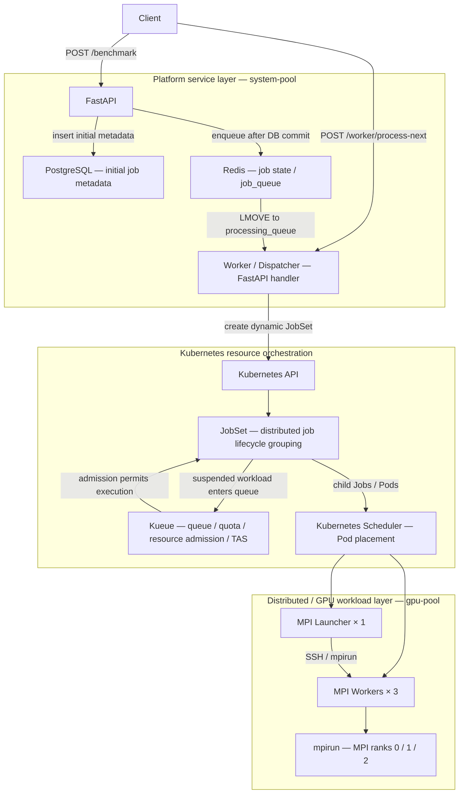

# HPC AI Performance Engineering Platform — Final Architecture

## Platform Positioning

HPC AI Performance Engineering Platform 是以工作提交、資源 admission、distributed execution 與跨層排障為核心的工程作品。主線展示 API 如何將 MPI 工作送入 Kubernetes／Kueue／JobSet；平行的 performance experiments 與 failure demos 展示資源診斷、效能分析及 recovery 能力。

作品對應 HPC AI Performance Engineer、GPU Platform Engineer、AI Infrastructure Engineer 與 Platform Engineer 的工作範疇。目前可展示範圍以 repo 實作與已保存 evidence 為準，尚未形成完整 benchmark closed-loop system。

閱讀入口：[MPI E2E demo](../demo/end-to-end-mpi-jobset-demo.md)、[展示腳本](../demo/platform-demo-script.md)、[Evidence Index](../evidence/README.md)。本文件描述保存的成功環境與程式邊界，不代表即時 cluster 健康檢查。

## Main Platform Flow

圖中的 PostgreSQL 與 Redis 都由 FastAPI 存取，沒有 DB 主動轉送到 Redis 的機制。實際 `POST /benchmark` 先保存 Redis job record，再 commit PostgreSQL metadata，最後將 job ID 加入 Redis queue；這些操作不是跨系統 transaction。

Worker 是 API 內的 `POST /worker/process-next` handler，需要明確呼叫，尚無獨立 worker daemon。它用 `LMOVE` 取得工作，只有 `benchmark == "mpi"` 會呼叫真實 Kubernetes dispatcher；其他 benchmark 目前走 simulated 分支。

Kueue 負責 queue、quota、ResourceFlavor 與 topology-aware resource scheduling／admission；Kubernetes Scheduler 負責 Pod 到 node 的 placement。JobSet 將 launcher／worker child Jobs 組成 distributed job lifecycle 單位，並依 failure policy 執行整組 recovery。圖中 JobSet 與 Kueue 的往返代表 controller 協作，不是同步函式呼叫。

| 實作責任 | Repo 入口 |
|---|---|
| Submission、queue、worker handler、Redis job status | [api/main.py](../../api/main.py) |
| PostgreSQL Job model／初始化 | [models.py](../../api/database/models.py)、[init_db.py](../../api/database/init_db.py) |
| 動態 `mpi-<job_id>` 與 worker DNS | [renderer.py](../../api/workloads/renderer.py) |
| In-cluster credentials／CustomObjectsApi | [dispatcher.py](../../api/workloads/dispatcher.py) |
| Launcher 1、workers 3、SSH、failure policy | [MPI template](../../api/workloads/templates/jobset-mpi.yaml) |
| Kueue resource configuration | [ClusterQueue](../../k8s/gpu-scheduling/clusterqueue.yaml)、[LocalQueue](../../k8s/gpu-scheduling/localqueue.yaml)、[ResourceFlavor](../../k8s/gpu-scheduling/resourceflavor.yaml)、[Topology](../../k8s/gpu-scheduling/topology.yaml) |

## GKE Architecture

主 E2E cluster 為 `hpc-gpu-sg`，platform namespace 為 `hpc-platform-dev`。

| Node Pool | 資源與用途 | Scheduling 邊界 |
|---|---|---|
| `system-pool` | CPU；FastAPI、Redis、PostgreSQL 等 platform/control workloads 與 kube-system workloads | 服務層部署分工；這不是 GKE managed Kubernetes control plane 本身 |
| `gpu-pool` | NVIDIA L4；MPI／distributed／GPU workloads | GPU taint：`nvidia.com/gpu=present:NoSchedule`；MPI launcher／worker 均有對應 toleration |

Node Pool 是 node 的管理群組，不等於單一 node；pool 名稱不能用來推論 node 數量。歷史 TAS／recovery 實驗只有一個實體 GPU node，主 E2E 的三個 worker Pod 也不能作為三台 node 的證據。

目前 [platform overlay](../../kustomize/overlays/gpu-sg-platform/kustomization.yaml) 包含 API、Redis、PostgreSQL 與共用 [API JobSet RBAC](../../k8s/security/api-jobset-rbac.yaml)。API 使用 `api-jobset-runner`，在 namespace 內具備 `get/list/watch/create jobsets`。Dev image tag 保存在 [values-dev.yaml](../../helm/api/values-dev.yaml)。

服務位於 `system-pool` 是主 demo 的部署分工；現有 overlay 未以 nodeSelector／affinity 明確鎖定該 pool。MPI placement 還依賴 Kueue ResourceFlavor／TAS，toleration 本身只允許 Pod 接受 taint，並不強制選擇 GPU node。

Overlay 不建立 GKE cluster、JobSet／Kueue controllers、queue resources 或 `mpi-ssh-key`。DB 初始化目前需執行 `python -m api.database.init_db`。完整前置條件與安全 SSH Secret 建立方式見 [Demo prerequisite](../demo/end-to-end-mpi-jobset-demo.md)。Private key 不保存在 repo。

## Supporting Engineering Paths

以下是平行 supporting demos／experiments，不是 MPI 執行後自動串接的 pipeline，也不表示全部部署於 `hpc-gpu-sg`。各自的環境、輸出與限制由 [Evidence Index](../evidence/README.md) 指向原始紀錄。

| Supporting path | 展示責任與主線關係 |
|---|---|
| Ray／KubeRay | Kubernetes Pod placement 與 Ray task scheduling 的差異；resource mismatch、task retry、worker reconciliation；未接入 API dispatcher |
| Slurm | 獨立 CPU HPC 環境的 multi-node MPI、partition／node／job 排障；不在 Kubernetes MPI 主線後面 |
| NCCL | 單 GPU transport discovery、IB 不可用後選用 Socket；不是主 MPI demo 自動執行的 benchmark |
| PyTorch／DDP | GPU runtime、training 與 CPU／Gloo DDP profiling 實驗；runtime adapters 未接入目前 MPI dispatch |
| vLLM | 獨立 inference serving、concurrency／throughput／latency 結果與 analyzer |
| Prometheus／Grafana／DCGM | HTTP、node、GPU 與 serving observability；尚未構成 per-job benchmark result collector |
| Terraform／Helm／Kustomize／Argo CD | IaC 與部署流程成果；新 platform overlay 與舊 Terraform／Argo CD 環境需分別看待 |
| Security／RBAC／NetworkPolicy | API identity、namespace 權限與 Pod hardening 實驗；NetworkPolicy 僅有設計／schema validation evidence |
| Failure Recovery | JobSet 整組 Recreate、Kueue admission blockage、Ray task retry；各自有不同 recovery domain |

Terraform dev 目前定義 `hpc-dev` 與 primary／observability pools；Argo CD dev 指向 `kustomize/overlays/dev`。因此不能把既有 GitOps 驗證寫成 `hpc-gpu-sg` 新主線已完整由 Terraform／Argo CD 管理。

## Implemented Boundary

**已實作且有成功紀錄的主線：** API submission → queue → JobSet dispatch → Kueue admission → MPI rank execution。

成功 JobSet 為 `mpi-52eedc2a-f6b1-4c97-9c11-529223ed6899`；[E2E evidence](../demo/end-to-end-mpi-jobset-demo.md) 保存 `SUSPENDED=false`、launcher／workers 與三個 MPI rank 輸出。

目前 MPI template request CPU，執行 rank／hostname 輸出與 `sleep 900`，沒有 request GPU 或執行 GPU 計算。這證明 GPU node pool 上的 distributed MPI execution，不證明 multi-node GPU performance。Worker sshd 持續運作，尚未形成正常完成與自動清理的閉環。

**尚未完成：**

- JobSet completion watcher。
- Kubernetes final status → API／PostgreSQL sync。
- Benchmark result collector。
- Automatic worker daemon。
- 涵蓋 submission、execution、completion、failure 與 result persistence 的 full lifecycle state machine。

API 在 MPI dispatch 後保存 `submitted` 與 JobSet name；查詢狀態來自 Redis。PostgreSQL 只保存初始 metadata，後續 status／retry_count 尚未同步。現有 retry／dead-letter 操作不等於 distributed job 全生命週期管理。

評估本作品時，應分別檢視主 E2E 的執行證據與 supporting paths 的排障／效能證據；完成 rank execution 不代表已完成 benchmark closed loop。
